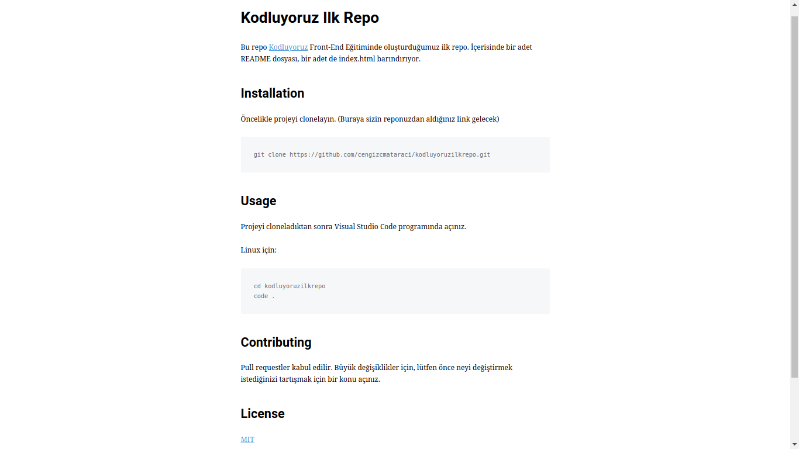

# Kodluyoruz Ilk Repo
Kodluyoruz Eğitimi kapsamında açtığım ilk repo içerisinde İçerisinde bir adet README dosyası, bir adet de index.html barındırıyor 

# Installation
Öncelikle projeyi clonelayın. (Buraya sizin reponuzdan aldığınız link gelecek)                   
>Git clone: https://github.com/FurkanAlperenDirlik/kodluyoruzilkrepo.git
# Usage
Projeyi cloneladıktan sonra Visual Studio Code programında açınız.

Linux için:

>cd kodluyoruzilkrepo code .

## Contributing
Pull requestler kabul edilir. Büyük değişiklikler için, lütfen önce neyi değiştirmek istediğinizi tartışmak için bir konu açınız.